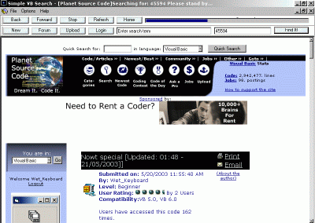



## Nowt special \[Updated: 01:48 \- 21/05/2003\]\]

### Description

This isn't anything special, so I expect alot of flames, and very low votes (please DO NOT vote unless you feel compelled to do so).

It's just something that my employer started working on a couple years ago and never bothered to finish. Searches PSC using keyword or author ID, autologin etc etc.

I know the code isn't very high standard, but thats cause I haven't bothered sorting it out (my employer had just started in VB around 2 weeks prior to building this).

This isn't much use for those whom consider themselves advanced as they probably already know all of this, may be of some use to beginners, thats about it.

---WITH THANKS TO MIN THANT SIN for sorting out the progress bar problem, much appreciated ;o)
 
### More Info
 

             |
---                |---
**Submitted On**   |2003-05-20 16:10:00
**By**             |[Wet\_Keyboard](https://github.com/Planet-Source-Code/PSCIndex/blob/master/ByAuthor/wet-keyboard.md)
**Level**          |Beginner
**User Rating**    |3.5 (14 globes from 4 users)
**Compatibility**  |VB 5\.0, VB 6\.0
**Category**       |[Jokes/ Humor](https://github.com/Planet-Source-Code/PSCIndex/blob/master/ByCategory/jokes-humor__1-40.md)
**World**          |[Visual Basic](https://github.com/Planet-Source-Code/PSCIndex/blob/master/ByWorld/visual-basic.md)
**Archive File**   |[Nowt\_speci1590045202003\.zip](https://github.com/Planet-Source-Code/wet-keyboard-nowt-special-updated-01-48-21-05-2003__1-45594/archive/master.zip)

